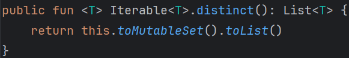

### 코틀린 sort() 함수

- Java 의 Collections.sort() 함수 사용
- time sort 알고리즘 사용

  ```
  💡Time Sort

    n이 작을 때는 삽입 정렬(Insertion Sort)을 사용하고,
    n이 커질 때는 병합 정렬(Merge sort)을 사용하는 알고리즘
  ```

- 시간 복잡도 : **O(n log n)** (최악, 평균, 최선의 경우 모두)
- 공간 복잡도 : **O(n)**
- 오름차순 정렬
- Kotlin의 Collections중 **MutableList** 에 대해서만 **sort()** 사용 가능
- **List** , **Array**, **Set**, **Map**, **Sequence** 에 대해서는 **sorted()** 사용
  - 내부적으로 **sort()** 함수를 사용하여 정렬

    
    
- sortedByDescending() : 내림차순 정렬
- sortedBy() : 특정 키를 기준으로 정렬
  ```kotlin
    val list = listOf(1, 2, 3, 4, 5)
    val sortedList = list.sortedBy { it % 3 }
    println(sortedList) // [3, 1, 4, 2, 5]
  ``` 
    
### Counting Sort
- 계수 정렬(Counting Sort)은 **정수** 로 표현할 수 있는 자료에 대해서만 정렬
- 시간 복잡도 : **O(n + k)** 
  - (n: 리스트의 개수, k: 정수의 최대값)
- 공간 복잡도 : **O(n + k)**
- 10^6 보다 작은 정수에 대해서 사용할 때 효과적

### Bubble Sort
- 모든 인접한 두 원소를 비교하여 정렬하는 알고리즘
- 시간 복잡도 : **O(n^2)** (최악, 평균, 최선의 경우 모두)
- 공간 복잡도 : **O(n)**

### 코틀린 sortedWith() 함수
- **sortedWith()** 함수를 사용하여 **Comparator** 를 사용한 정렬 가능
- **compareBy()** 함수를 사용하여 여러 기준으로 정렬 가능
  ```kotlin
    val list = listOf("one", "two", "three", "four", "five")
    val sortedList = list.sortedWith(compareBy ({ it.length }, { it }))
    println(sortedList)  // [one, two, four, five, three]
  ```
  
### 중복제거 후 정렬
- **distinct()** 함수를 사용하여 중복 제거 후 정렬 가능
  ```kotlin
    val list = listOf(1, 2, 3, 4, 5, 1, 2, 3, 4, 5)
    val sortedList = list.distinct().sorted()
    println(sortedList) // [1, 2, 3, 4, 5]
  ```

- **toMutableSet()** 함수를 사용하여 중복 제거 후 정렬 가능
  ```kotlin
    val sortedList = list.toMutableSet().sorted()
  ```

- **distinct()** 함수는 내부적으로 **toMutableSet()** 함수를 사용
  
  
